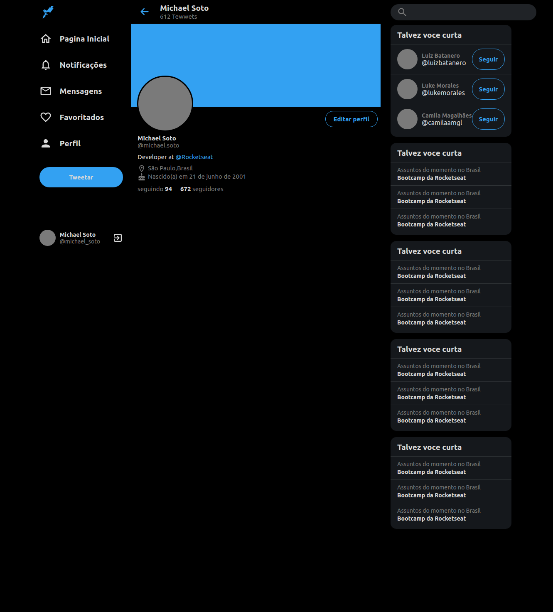

<h1 align="center">
 Twitter- Layout
</h1>

<p align="center">
  <a href="#-tecnologias">Tecnologias</a>&nbsp;&nbsp;&nbsp;|&nbsp;&nbsp;&nbsp;
  <a href="#-projeto">Projeto</a>&nbsp;&nbsp;&nbsp;|&nbsp;&nbsp;&nbsp;
  <a href="#-layout">Layout</a>&nbsp;&nbsp;&nbsp;|&nbsp;&nbsp;&nbsp;
  <a href="#-como-executar">Como executar</a>&nbsp;&nbsp;&nbsp;
  
</p>

<p align="center">
  
</p>

 
</p>


## ✨ Tecnologias

Esse projeto foi desenvolvido com as seguintes tecnologias:

- [React](https://reactjs.org)
- [TypeScript](https://www.typescriptlang.org/)

## 💻 Projeto

O Template-Twitter é um modelo de website desenvolvido no youtube

## 🔖 Layout

Você pode visualizar o layout do projeto através [desse link](https://www.figma.com/file/cjNh1bd93pbJBFOza25K7L/Rocketseat-Twitter-Clone?node-id=1%3A2). É necessário ter conta no [Figma](http://figma.com/) para acessá-lo.

## 🚀 Como executar

 Clonar o repositorio:
```bash
$ git clone https://github.com/nicksoto1/template-twitter.git
```
Acessar o repertório:
```bash
$ cd template-twitter
```

 Instalar as dependências:
```bash
$ yarn install
```

 Iniciar o projeto:
```bash
$ yarn start
```


Agora você pode acessar [`localhost:3000`](http://localhost:3000) do seu navegador.


Feito com  Rocketseat pelo  https://www.youtube.com/watch?v=K-8z_4xvT3o

## ✒️ Author

<a href="https://github.com/nicksoto1">
 
 <br />
 <sub><b>Michael Soto</b></sub></a> <a href="https://github.com/nicksoto1">🚀</a>
 <br />
